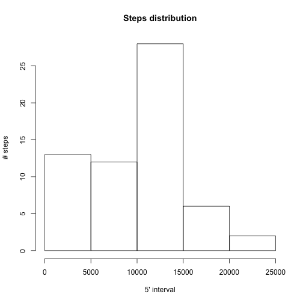
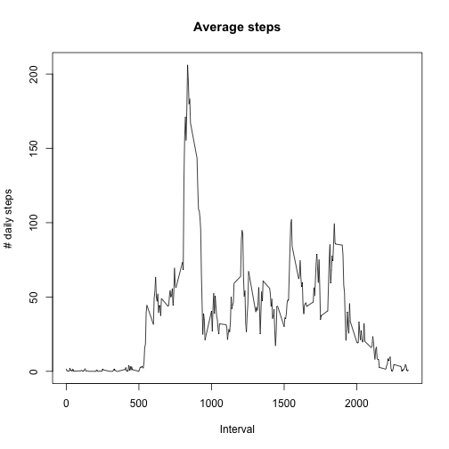
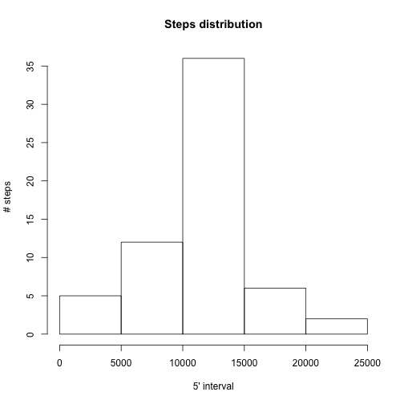
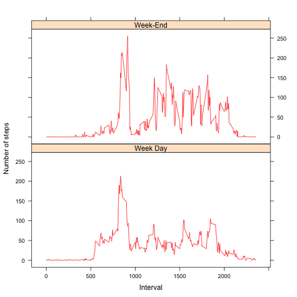

This is the R Markdown document as required by the Coursera "Reproductible Research" course's assignement #1.  


# Helper Functions
Let's start with some helper functions that allow us to uncrompress the provided data file , reading and filling the dataset up with measured values, and ending with a function computing the total number of step done in a day..

### Uncompress the provided data file (unziping the .zip file)
This function does not return anything, but makes the job to unzip the archive given by parameter *fileName*:

```r
#
# Unzip data archive file. Default file name="activity.zip"
#
uncompressDataArchive = function(fileName="activity.zip"){ 
    unzip(fileName, files = NULL, list = FALSE, overwrite = TRUE,
          junkpaths = FALSE, exdir = ".", unzip = "internal",
          setTimes = FALSE)
}
```

### Read the data file and load values in the returned data frame
Load any CSV formatted file given by parameter *fromFileName*

Returns a data frame corresponding to the CSV file

```r
#
# Load dataset according to a file name which defaulted to "activity.csv"
#
loadDataset = function(fromFileName="activity.csv"){
  dataSet=read.csv(fromFileName)
  return(dataSet)
}
```

### Compute the total number of steps by date. 
Returns a data frame made of 2 variables: 

- date : POSIX : the considered date
- steps: numeric : Total number of steps done the day date

```r
#
# Compute mean steps by date
#
# Return a new data.frame with 2 columns:
#     - date : POSIX Date in YYYY-MM-DD format
#     - steps: numeric : Total number of steps in the day "date"
getNumberOfStepsByDate = function(dataSet){
  totalStepPerDay = tapply(dataSet$steps, dataSet$date, sum, na.rm = TRUE)
  theDate = names(totalStepPerDay)
  theTotal = as.numeric(totalStepPerDay)
  result = data.frame(date=strptime(theDate, format="%Y-%m-%d"), steps=theTotal)
  return( result )
}
```


# Here we go with assignment questions

## Loading and preprocessing the data

```r
#
# PREREQUISITE: Loading and preprocessing the data
#

#   Step 1: explode the zip archive
uncompressDataArchive()

#   Step 2: Read the original dataset
originalDF = loadDataset()
```


## QUESTION 1: What is mean total number of steps taken per day?
  
###   Step 1: Calculate the total number of steps taken per day

```r
question1DF = getNumberOfStepsByDate( subset(originalDF, !is.na(originalDF$date)) )
```

```
##          date steps
## 1  2012-10-01     0
## 2  2012-10-02   126
## 3  2012-10-03 11352
## 4  2012-10-04 12116
## 5  2012-10-05 13294
## 6  2012-10-06 15420
## 7  2012-10-07 11015
## 8  2012-10-08     0
## 9  2012-10-09 12811
## 10 2012-10-10  9900
## 11 2012-10-11 10304
## 12 2012-10-12 17382
## 13 2012-10-13 12426
## 14 2012-10-14 15098
## 15 2012-10-15 10139
## 16 2012-10-16 15084
## 17 2012-10-17 13452
## 18 2012-10-18 10056
## 19 2012-10-19 11829
## 20 2012-10-20 10395
## 21 2012-10-21  8821
## 22 2012-10-22 13460
## 23 2012-10-23  8918
## 24 2012-10-24  8355
## 25 2012-10-25  2492
## 26 2012-10-26  6778
## 27 2012-10-27 10119
## 28 2012-10-28 11458
## 29 2012-10-29  5018
## 30 2012-10-30  9819
## 31 2012-10-31 15414
## 32 2012-11-01     0
## 33 2012-11-02 10600
## 34 2012-11-03 10571
## 35 2012-11-04     0
## 36 2012-11-05 10439
## 37 2012-11-06  8334
## 38 2012-11-07 12883
## 39 2012-11-08  3219
## 40 2012-11-09     0
## 41 2012-11-10     0
## 42 2012-11-11 12608
## 43 2012-11-12 10765
## 44 2012-11-13  7336
## 45 2012-11-14     0
## 46 2012-11-15    41
## 47 2012-11-16  5441
## 48 2012-11-17 14339
## 49 2012-11-18 15110
## 50 2012-11-19  8841
## 51 2012-11-20  4472
## 52 2012-11-21 12787
## 53 2012-11-22 20427
## 54 2012-11-23 21194
## 55 2012-11-24 14478
## 56 2012-11-25 11834
## 57 2012-11-26 11162
## 58 2012-11-27 13646
## 59 2012-11-28 10183
## 60 2012-11-29  7047
## 61 2012-11-30     0
```

###   Step 2: Make a histogram of the total number of steps taken each day
 

###   Step 3: Calculate and report the mean and median of the total number of steps taken per day

- Mean:

```r
meanQuestion1 = mean(question1DF$steps)
```

```
## [1] 9354.23
```
- Median:

```r
medianQuestion1 = median(question1DF$steps)
```

```
## [1] 10395
```

Let's save some memory by removing unused varaibels:

```r
rm(question1DF) # gain some memory space by removing this dataset (no more use)
```


## QUESTION 2: What is the average daily activity pattern?

###   Step 1: Make a time series plot (i.e. type = "l") of the 5-minute interval (x-axis) and the average number of steps taken, averaged across all days (y-axis)


```r
question2List=tapply(originalDF$steps, originalDF$interval, mean, na.rm = TRUE)
plot(names(question2List), as.numeric(question2List), 
     type = "l",
     xlab = "Interval", ylab = "# daily steps", main = "Average steps")
```

 

###   Step 2: Which 5-minute interval, on average across all the days in the dataset, contains the maximum number of steps?

```r
idxMaxSteps = which.max(question2List)
intervalMaxStep = as.numeric(names(question2List)[idxMaxSteps])
intervalMaxStep.hour = floor(intervalMaxStep/60)
intervalMaxStep.minute = intervalMaxStep%%60
sprintf("5' Interval #%d (starting at %02d:%02d:00) contains the maximum average number of steps over all days in the dataset: %0.2f",
        intervalMaxStep, intervalMaxStep.hour, intervalMaxStep.minute, question2List[idxMaxSteps])
```

```
## [1] "5' Interval #835 (starting at 13:55:00) contains the maximum average number of steps over all days in the dataset: 206.17"
```


## QUESION 3: Imputing missing values

**Note:** There are a number of days/intervals where there are missing values (coded as NA). 
The presence of missing days may introduce bias into some calculations or summaries of the data.

###   Step 1: Calculate and report the total number of missing values in the dataset (i.e. the total number of rows with NAs)

```r
missingStepIdx = which(is.na(originalDF$steps))
sprintf("There are %d missing values in the original dataset", length(missingStepIdx) )
```

```
## [1] "There are 2304 missing values in the original dataset"
```

###   Step 2 & 3: Devise a strategy for filling in all of the missing values in the dataset. 
<br>The strategy does not need to be sophisticated. For example, you could use the mean/median for that day, or the mean for that 5-minute interval, etc.
<br><br>               Create a new dataset that is equal to the original dataset but with the missing data filled in.
<br>
*The choosen strategy is to assign missing values the previously calculated mean (rounded) that corresponds to the same time interval*

```r
question3DF = originalDF
question3DF$steps[missingStepIdx] = floor( as.numeric(question2List[as.character(originalDF$interval[missingStepIdx])]) + 0.5 )
question3DF = getNumberOfStepsByDate( question3DF )
```

```
##          date steps
## 1  2012-10-01 10762
## 2  2012-10-02   126
## 3  2012-10-03 11352
## 4  2012-10-04 12116
## 5  2012-10-05 13294
## 6  2012-10-06 15420
## 7  2012-10-07 11015
## 8  2012-10-08 10762
## 9  2012-10-09 12811
## 10 2012-10-10  9900
## 11 2012-10-11 10304
## 12 2012-10-12 17382
## 13 2012-10-13 12426
## 14 2012-10-14 15098
## 15 2012-10-15 10139
## 16 2012-10-16 15084
## 17 2012-10-17 13452
## 18 2012-10-18 10056
## 19 2012-10-19 11829
## 20 2012-10-20 10395
## 21 2012-10-21  8821
## 22 2012-10-22 13460
## 23 2012-10-23  8918
## 24 2012-10-24  8355
## 25 2012-10-25  2492
## 26 2012-10-26  6778
## 27 2012-10-27 10119
## 28 2012-10-28 11458
## 29 2012-10-29  5018
## 30 2012-10-30  9819
## 31 2012-10-31 15414
## 32 2012-11-01 10762
## 33 2012-11-02 10600
## 34 2012-11-03 10571
## 35 2012-11-04 10762
## 36 2012-11-05 10439
## 37 2012-11-06  8334
## 38 2012-11-07 12883
## 39 2012-11-08  3219
## 40 2012-11-09 10762
## 41 2012-11-10 10762
## 42 2012-11-11 12608
## 43 2012-11-12 10765
## 44 2012-11-13  7336
## 45 2012-11-14 10762
## 46 2012-11-15    41
## 47 2012-11-16  5441
## 48 2012-11-17 14339
## 49 2012-11-18 15110
## 50 2012-11-19  8841
## 51 2012-11-20  4472
## 52 2012-11-21 12787
## 53 2012-11-22 20427
## 54 2012-11-23 21194
## 55 2012-11-24 14478
## 56 2012-11-25 11834
## 57 2012-11-26 11162
## 58 2012-11-27 13646
## 59 2012-11-28 10183
## 60 2012-11-29  7047
## 61 2012-11-30 10762
```

###   Step 4: Made of 4 steps: a, b, c and d
4.a: Make a histogram of the total number of steps taken each day
 

4.b: Calculate and report the mean and median total number of steps taken per day
-Mean:

```r
meanQuestion3 = mean(question3DF$steps)
```

```
## [1] 10765.64
```
-Median:

```r
medianQuestion3 = median(question3DF$steps)
```

```
## [1] 10762
```


4.c: Do these values differ from the estimates from the first part of the assignment?

**Response:** Only the mean is changing since according to the choosen strategy, the distribution does not change, thus the median won't change

4.d: What is the impact of imputing missing data on the estimates of the total daily number of steps?

**Response:** The impact of imputing missing data with ur strategy did get the mean value raising


Let's gain some more memory by removing new no more used variables

```r
rm(question3DF) # gain some memory space by removing this dataset (no more use)
```

## QUESION 4: Are there differences in activity patterns between weekdays and weekends?

```r
WEEK_DAY = "Week Day" # Constant for weekday.type factor column (see below) => It's on week day
WEEK_END = "Week-End" # Constant for weekday.type factor column (see below) => It's on week-end
question4DF = originalDF
question4DF$steps[missingStepIdx] = floor( as.numeric(question2List[as.character(originalDF$interval[missingStepIdx])]) + 0.5 )
```

###   Step 1: Create a new factor variable in the dataset with two levels – “weekday” and “weekend” indicating whether a given date is a weekday or weekend day.

```r
question4DF$weekday = strptime(question4DF$date, format = "%Y-%m-%d")
question4DF$weekday = lapply( question4DF$weekday$wday, # Avoid localisation issue (I'm using a french locale)
                              function(x){ 
                                if (x>5)
                                  return(WEEK_END)
                                else 
                                  return(WEEK_DAY)
                                }
                              )
question4DF$weekday = as.factor(as.character(question4DF$weekday))
```

### Step 2: Make a panel plot containing a time series plot (i.e. type = "l") of the 5-minute interval (x-axis) and the average number of steps taken, averaged across all weekday days or weekend days (y-axis). <br> See the README file in the GitHub repository to see an example of what this plot should look like using simulated data.


```r
library(lattice) # Just to get sure the package is loaded

# Build weekday dataset with total steps an interval over all considered week days 
weekdayDF = subset(question4DF, question4DF$weekday == WEEK_DAY)
weekdayAvg = tapply(weekdayDF$steps, weekdayDF$interval, mean)
weekdayAvgDF = data.frame( interval = as.numeric( names(weekdayAvg) ), steps = floor(as.numeric(weekdayAvg)+0.5), weekday.type = rep(WEEK_DAY,length(weekdayAvg) ) )

# Build weekend dataset with total steps an interval over all considered week-end day
weekendDF = subset(question4DF, question4DF$weekday == WEEK_END)
weekendAvg = tapply(weekendDF$steps, weekendDF$interval, mean)
weekendAvgDF = data.frame( interval = as.numeric( names(weekendAvg) ), steps = floor(as.numeric(weekendAvg)+0.5), weekday.type = rep(WEEK_END,length(weekendAvg) ) ) 

# The final dataset is made of the two above dataset (weekday and weekden)
resultPanel = rbind(weekdayAvgDF,weekendAvgDF)

# Plot the panel as expected by the assignment
xyplot( steps ~ interval | weekday.type, data = resultPanel, 
        layout=c(1,2), type="l", col="red", xlab="Interval", ylab="Number of steps" )
```

 
